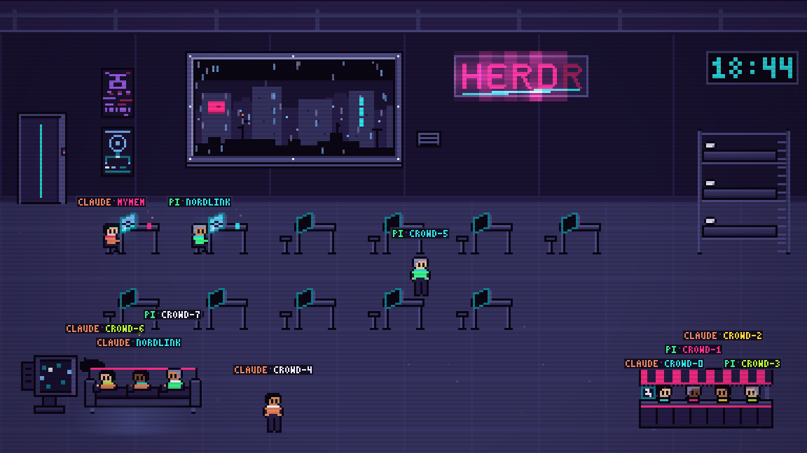

# Agent View

A cyberpunk pixel-art office for your [herdr](https://herdr.dev) agents,
built on [Electrobun](https://github.com/blackboardsh/electrobun).



Every AI agent running in herdr appears as a little pixel person in a shared
neon-lit room. One glance at the window tells you who is working, who is
stuck waiting for you, and who is slacking off in front of the TV.

| herdr status | in the room |
|---|---|
| `working` | sits at their desk, typing at an angled holo-screen |
| `blocked` (waiting for your input) | stands up, raises a hand, jumps — `!` |
| `idle` | couch & TV first; ramen bar when the couch is full; bed after ~5 min |
| `unknown` | stands around confused — `?` |
| pane closed | walks out through the sliding door |

## Install

```sh
brew install --cask jgwesterlund/tap/agent-view
```

Apple Silicon, macOS 14+. The app is ad-hoc signed but not notarized; the
cask clears the quarantine flag for you. If macOS still blocks the first
launch, run `xattr -dr com.apple.quarantine "/Applications/Agent View.app"`.

You'll also need [herdr](https://herdr.dev) installed and running — Agent
View reads its agent list from herdr through the Agent View daemon. The app
gets its data from the daemon, which for now is installed from a source
checkout with `bun run install:daemon` (see [Daemon](#daemon)); bundling it
with the app is not done yet.

## The room

- **Characters walk** between spots along walk lanes — no teleporting. New
  agents file in through the sliding door one by one.
- **Every agent owns a desk** (assigned on first sight, freed when the pane
  closes) and always returns to the same seat.
- **Idle chain:** 3 couch seats (the TV switches on), then a 4-seat ramen
  bar — steaming noodle bowls in each guest's project color — then loiter
  spots. After ~5 minutes idle they climb into the bunk bed (zZz).
- **Colors are collision-free:** 5 agent outfit colors and 5 project accent
  colors, handed out first-come-first-served and persisted in localStorage.
  Same project = same accent (scarf, nametag, blanket stripe, mug, bowl).
- **Name tags** render on a fixed-size HUD layer above the pixel scene, so
  they stay small and crisp at any window size. The herdr-focused pane gets
  a bobbing yellow caret.
- **Ambience:** rain and parallax skyline in the window, a 24h wall clock,
  scanlines + vignette, steam, dust, TV light pools — and a HERDR neon sign
  whose second R keeps dying.
- **Daemon the cat** wanders, naps on the couch arm, and if you ignore a
  blocked agent for more than a minute, walks to that desk and stares at you.
- **Offline is explicit:** if herdr or the daemon is down you get a blacked-out room and a
  flickering OFFLINE banner — never silently stale data.

## Interaction

The window is a frameless neon widget: drag it by the title strip, `◎` pins
it always-on-top, `×` quits. Hover a character for status details;
double-click to focus that agent's pane in herdr.

## Run from source

```bash
bun install
bun run daemon       # foreground daemon (or bun run install:daemon once)
bun start            # live herdr data, via the daemon
bun run dev          # live + watch mode, via the daemon
bun run fake         # HERDR_FAKE=1 — deterministic 90s demo loop, no herdr needed
bun run chaos        # randomized soak test
bun test             # data-layer unit tests
```

## Daemon

Agent View's office lives in a small background daemon. It polls herdr and serves the room to the app over a
WebSocket on `127.0.0.1:47371`. The app shows **daemon not running** until it is installed:

```sh
bun run install:daemon     # bundle, install as a LaunchAgent, start at login
bun run uninstall:daemon   # stop and remove (keeps saved state and the log)
```

- Log: `~/Library/Logs/Agent View/daemon.log`
- Check: `curl -s 127.0.0.1:47371/v1/health` and `curl -s 127.0.0.1:47371/v1/world`
- Restart: `launchctl kickstart -k gui/$UID/com.cygnisec.agentview.daemon`
- Re-run `bun run install:daemon` after pulling changes.
- The install bundles the daemon next to a copy of bun, so it needs neither this checkout nor bun on PATH.

For development, `bun run daemon` runs it in the foreground (set `AGENT_VIEW_PORT` to stay off the installed one).
`bun run fake` / `bun run chaos` start their own in-process daemon on port 47372 and need nothing installed.

## How it works

- **Daemon** (`src/daemon/`) runs the herdr poller (`HerdrPoller` in
  `src/bun/herdr.ts`), which normalizes and debounces statuses (2 consecutive
  polls to change, except `blocked` which is instant — the raised hand is the
  whole point), and pushes full world snapshots to clients over a WebSocket on
  `127.0.0.1:47371`.
- **Bun process** (`src/bun/`) connects to the daemon (`src/bun/daemon-client.ts`)
  and forwards each snapshot to the webview over Electrobun's typed RPC.
- **Webview** (`src/mainview/`) is a 384x216 canvas scene scaled by integer
  factors (WKWebView, `image-rendering: pixelated`). Characters are driven
  by a small state machine over walk lanes; everything y-sorts for depth.
  Effects never use `ctx.filter`/`shadowBlur` in the frame loop — glow is
  pre-rendered and stamped with `globalCompositeOperation: "lighter"`.
- **All pixel art is code** — string rows + palette maps in
  `src/mainview/sprites/sheets/`, no binary assets. Sprites bake to
  OffscreenCanvases once at boot.
- **Shared contract** lives in `src/shared/types.ts`.

### Art tooling

Render any sprite sheet (or the 3x5 bitmap font) to a PNG contact sheet:

```bash
bun tools/preview.ts src/mainview/sprites/sheets/character.ts /tmp/preview.png 10
```

### Dev frame dumps

Launch with `AGENTVIEW_SHOT=/tmp/shot.png` and the app writes its rendered
frame there a few seconds after load and every 10s (or press `s`). Handy for
checking the scene without screen-recording permissions.

### Note on first build

Electrobun's CLI downloads its native binaries from GitHub Releases on first
build. If that fails with a certificate error, fetch manually:

```bash
curl -sL -o /tmp/eb-core.tar.gz https://github.com/blackboardsh/electrobun/releases/download/v1.18.1/electrobun-core-darwin-arm64.tar.gz
mkdir -p node_modules/electrobun/dist-macos-arm64
tar -xzf /tmp/eb-core.tar.gz -C node_modules/electrobun/dist-macos-arm64
```
